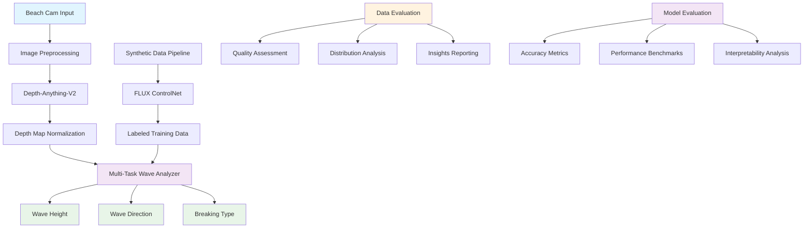

# Design Document: AI-Powered Wave Analysis System for Surfers

## Overview

The SwellSight Wave Analysis System is a sophisticated AI pipeline designed to transform raw beach cam footage into actionable wave metrics for surfers. The system employs a three-stage hybrid architecture combining advanced depth estimation, synthetic data generation, and multi-task learning to deliver precise measurements of wave height, direction, and breaking type.

The system addresses the critical challenge faced by surfers who must assess wave conditions from distant, low-quality beach cam footage. By leveraging state-of-the-art computer vision models and a novel sim-to-real training approach, SwellSight provides automated, accurate wave analysis that surpasses manual assessment in both speed and precision.

## Architecture

### Three-Stage Hybrid Pipeline

The system implements a hybrid pipeline where generative AI is used to train analytical AI:

1. **Stage A: Depth Extraction (The "Eye")** - Converts 2D beach cam images into high-sensitivity depth maps
2. **Stage B: Synthetic Data Factory (The "Simulator")** - Generates labeled synthetic training data
3. **Stage C: Wave Analyzer (The "Brain")** - Multi-task model predicting wave metrics



### Model Selection Rationale

| Component | Selected Model | Justification |
|-----------|---------------|---------------|
| **Depth Estimation** | Depth-Anything-V2-Large | Outperforms MiDaS in outdoor marine environments; preserves sharp wave edges and water texture |
| **Synthetic Generation** | FLUX.1-dev + ControlNet-Depth | Superior image quality vs SDXL; physics-accurate depth conditioning |
| **Feature Backbone** | DINOv2-base | Self-supervised geometric understanding; better than ResNet for spatial relationships |

## Components and Interfaces

### Stage A: Depth Extraction Engine

**Purpose**: Convert 2D beach cam images into high-sensitivity depth maps that capture wave geometry and texture.

**Architecture**:
- **Model**: Depth-Anything-V2-Large (518×518 input resolution)
- **Precision**: FP16 for memory efficiency
- **Input**: RGB beach cam images (480p-4K resolution)
- **Output**: Normalized grayscale depth maps

**Key Features**:
- Preserves sharp wave edges typically lost in standard depth models
- Maintains depth sensitivity for distant objects (far-field waves)
- Optimized for outdoor marine environments with varying lighting
- Statistical validation of depth map quality

**Interface**:
```python
class DepthExtractor:
    def extract_depth(self, image: np.ndarray) -> DepthMap:
        """Extract normalized depth map from beach cam image"""
        
    def validate_quality(self, depth_map: DepthMap) -> QualityMetrics:
        """Assess depth map quality using statistical measures"""
```

### Stage B: Synthetic Data Factory

**Purpose**: Generate diverse, labeled synthetic wave imagery for training robust models without manual annotation.

**Architecture**:
- **Base Model**: FLUX.1-dev (1024×1024 generation)
- **Control**: Shakker-Labs FLUX.1-dev-ControlNet-Depth
- **Training**: 70K steps, batch size 64, controlnet_conditioning_scale 0.3-0.7
- **Depth Extraction**: Uses Depth-Anything-V2 for conditioning

**Generation Strategy**:
- Create diverse weather/lighting conditions while preserving wave geometry
- Generate balanced datasets across all wave conditions
- Automatic labeling with ground-truth wave characteristics
- Physics-accurate wave synthesis respecting depth constraints

**Interface**:
```python
class SyntheticDataGenerator:
    def generate_wave_scene(self, depth_map: DepthMap, conditions: WeatherConditions) -> SyntheticImage:
        """Generate synthetic wave image conditioned on depth map"""
        
    def create_balanced_dataset(self, target_size: int) -> LabeledDataset:
        """Generate balanced dataset across all wave conditions"""
```

### Stage C: Multi-Task Wave Analyzer

**Purpose**: Unified model that simultaneously predicts wave height, direction, and breaking type from RGB+Depth input.

**Architecture**:
- **Backbone**: DINOv2-base (frozen self-supervised features)
- **Input**: 4-channel (RGB + Depth) at 518×518 resolution
- **Heads**: Three specialized prediction heads
  - Height Head: Regression (0.5-8.0 meters)
  - Direction Head: Classification (Left/Right/Straight)
  - Breaking Type Head: Classification (Spilling/Plunging/Surging)

**Multi-Task Learning Design**:
- Shared DINOv2 backbone for geometric understanding
- Task-specific heads with balanced loss weighting
- Confidence estimation for all predictions
- Real-time inference (<200ms per image)

**Interface**:
```python
class WaveAnalyzer:
    def analyze_waves(self, rgb_image: np.ndarray, depth_map: DepthMap) -> WaveMetrics:
        """Predict all wave metrics simultaneously"""
        
    def get_confidence_scores(self) -> ConfidenceScores:
        """Return confidence scores for all predictions"""
```

### Data Evaluation Framework

**Purpose**: Comprehensive assessment of data quality, distribution analysis, and insights generation for both real and synthetic datasets.

**Components**:
- **Quality Assessment**: Statistical analysis of image quality, resolution, contrast, and ocean coverage
- **Distribution Analysis**: Comparison between synthetic and real data distributions
- **Insights Reporting**: Automated generation of data quality reports and visualizations
- **Data Health Monitoring**: Continuous monitoring of data pipeline health and drift detection

**Interface**:
```python
class DataEvaluator:
    def assess_quality(self, dataset: Dataset) -> QualityReport:
        """Assess overall data quality with detailed metrics"""
        
    def compare_distributions(self, real_data: Dataset, synthetic_data: Dataset) -> DistributionComparison:
        """Compare statistical distributions between datasets"""
        
    def generate_insights_report(self, datasets: List[Dataset]) -> InsightsReport:
        """Generate comprehensive data insights and recommendations"""
```

### Model Evaluation Framework

**Purpose**: Comprehensive evaluation of model performance, accuracy metrics, benchmarking, and interpretability analysis.

**Components**:
- **Accuracy Metrics**: Wave-specific metrics (height MAE/RMSE, direction/breaking classification metrics)
- **Performance Benchmarking**: Inference speed, memory usage, and throughput analysis
- **Interpretability Tools**: Attention visualization, feature importance, and failure analysis
- **Evaluation Reporting**: Automated report generation with metrics, visualizations, and recommendations

**Interface**:
```python
class ModelEvaluator:
    def evaluate_accuracy(self, model: WaveAnalyzer, test_data: Dataset) -> AccuracyMetrics:
        """Evaluate model accuracy across all wave prediction tasks"""
        
    def benchmark_performance(self, model: WaveAnalyzer, hardware_config: HardwareConfig) -> PerformanceBenchmark:
        """Benchmark model performance on specified hardware"""
        
    def analyze_interpretability(self, model: WaveAnalyzer, samples: List[BeachCamImage]) -> InterpretabilityAnalysis:
        """Analyze model decision-making and feature importance"""
        
    def generate_evaluation_report(self, results: EvaluationResults) -> EvaluationReport:
        """Generate comprehensive evaluation report with visualizations"""
```

## Data Models

### Core Data Structures

```python
@dataclass
class WaveMetrics:
    height_meters: float
    height_feet: float
    height_confidence: float
    direction: DirectionCategory  # LEFT, RIGHT, STRAIGHT
    direction_confidence: float
    breaking_type: BreakingType  # SPILLING, PLUNGING, SURGING
    breaking_confidence: float
    timestamp: datetime
    extreme_conditions: bool

@dataclass
class DepthMap:
    data: np.ndarray  # Normalized depth values [0,1]
    resolution: Tuple[int, int]
    quality_score: float
    edge_preservation: float

@dataclass
class BeachCamImage:
    rgb_data: np.ndarray
    resolution: Tuple[int, int]
    format: ImageFormat  # JPEG, PNG, WEBP
    quality_score: float
    ocean_region_mask: np.ndarray

@dataclass
class SyntheticImage:
    rgb_data: np.ndarray
    depth_map: DepthMap
    ground_truth_labels: WaveMetrics
    generation_params: GenerationConfig
```

### Training Data Schema

```python
@dataclass
class TrainingExample:
    image_id: str
    rgb_image: BeachCamImage
    depth_map: DepthMap
    labels: WaveMetrics
    data_source: DataSource  # REAL, SYNTHETIC
    augmentation_applied: List[str]

@dataclass
class Dataset:
    examples: List[TrainingExample]
    split: DataSplit  # TRAIN, VALIDATION, TEST
    balance_metrics: DatasetBalance
    statistics: DatasetStatistics

### Evaluation Data Models

```python
@dataclass
class QualityReport:
    overall_score: float
    resolution_analysis: ResolutionStats
    contrast_analysis: ContrastStats
    ocean_coverage_analysis: CoverageStats
    quality_issues: List[QualityIssue]
    recommendations: List[str]

@dataclass
class DistributionComparison:
    kl_divergence: float
    wasserstein_distance: float
    statistical_tests: Dict[str, float]
    visual_similarity_score: float
    distribution_match_score: float

@dataclass
class AccuracyMetrics:
    height_metrics: HeightAccuracyMetrics
    direction_metrics: ClassificationMetrics
    breaking_type_metrics: ClassificationMetrics
    confidence_calibration: CalibrationMetrics
    overall_score: float

@dataclass
class HeightAccuracyMetrics:
    mae: float  # Mean Absolute Error
    rmse: float  # Root Mean Square Error
    accuracy_within_02m: float  # Percentage within ±0.2m
    accuracy_within_05m: float  # Percentage within ±0.5m
    extreme_condition_detection: float

@dataclass
class ClassificationMetrics:
    accuracy: float
    precision_per_class: Dict[str, float]
    recall_per_class: Dict[str, float]
    f1_score_per_class: Dict[str, float]
    confusion_matrix: np.ndarray
    macro_avg_f1: float

@dataclass
class PerformanceBenchmark:
    inference_time_ms: float
    memory_usage_mb: float
    throughput_images_per_second: float
    gpu_utilization: float
    cpu_utilization: float
    hardware_config: HardwareConfig

@dataclass
class InterpretabilityAnalysis:
    attention_maps: Dict[str, np.ndarray]
    feature_importance: Dict[str, float]
    failure_cases: List[FailureCase]
    decision_explanations: List[DecisionExplanation]
```

## Correctness Properties

*A property is a characteristic or behavior that should hold true across all valid executions of a system—essentially, a formal statement about what the system should do. Properties serve as the bridge between human-readable specifications and machine-verifiable correctness guarantees.*

### Property 1: Input Format Validation
*For any* input image with resolution between 480p and 4K in JPEG/PNG/WebP format, the Wave_Analyzer should successfully process the image and return valid results
**Validates: Requirements 1.1, 1.3**

### Property 2: Image Quality Enhancement
*For any* input image with measurable quality issues, applying image enhancement should improve quantifiable quality metrics while preserving wave information
**Validates: Requirements 1.2**

### Property 3: Ocean Region Detection
*For any* image containing mixed content (ocean and non-ocean areas), the system should correctly identify and focus processing on ocean regions with high accuracy
**Validates: Requirements 1.4**

### Property 4: Depth Map Edge Preservation
*For any* beach cam image with visible wave edges, the generated depth map should preserve sharp wave boundaries with measurable edge preservation metrics
**Validates: Requirements 2.1**

### Property 5: Water Texture Capture
*For any* image with visible water surface texture, the depth map should capture fine-grained surface details with appropriate texture preservation scores
**Validates: Requirements 2.2**

### Property 6: Far-Field Depth Sensitivity
*For any* image with distant waves, the depth extraction should maintain sensitivity for far-field objects with consistent depth gradients
**Validates: Requirements 2.3**

### Property 7: Depth Map Normalization
*For any* generated depth map, normalization should ensure waves stand out against the ocean surface with measurable contrast ratios
**Validates: Requirements 2.4**

### Property 8: Wave Height Accuracy
*For any* wave with known ground truth height, the predicted height should be within ±0.2m of the actual measurement
**Validates: Requirements 3.1**

### Property 9: Dominant Wave Selection
*For any* scene with multiple waves of different heights, the system should correctly identify and report the dominant (highest) wave
**Validates: Requirements 3.2**

### Property 10: Unit Conversion Accuracy
*For any* wave height measurement in meters, the corresponding feet conversion should be mathematically correct (meters × 3.28084)
**Validates: Requirements 3.3**

### Property 11: Extreme Condition Detection
*For any* wave with height below 0.5m or above 8.0m, the system should flag extreme conditions appropriately
**Validates: Requirements 3.4**

### Property 12: Direction Classification Accuracy
*For any* wave with known breaking direction, the system should classify it correctly as Left, Right, or Straight with 90% accuracy
**Validates: Requirements 4.1, 4.2**

### Property 13: Mixed Direction Handling
*For any* scene with waves breaking in multiple directions, the system should identify the dominant direction and note mixed conditions
**Validates: Requirements 4.3**

### Property 14: Breaking Type Classification
*For any* wave with known breaking pattern, the system should correctly classify it as Spilling, Plunging, or Surging with 92% accuracy
**Validates: Requirements 5.1, 5.2**

### Property 15: Synthetic Data Realism
*For any* depth map input to FLUX ControlNet, the generated synthetic image should be photorealistic and preserve the input wave geometry
**Validates: Requirements 6.1**

### Property 16: Condition Variation Preservation
*For any* synthetic generation with varied weather/lighting conditions, the underlying wave geometry should remain consistent with the input depth map
**Validates: Requirements 6.2**

### Property 17: Automatic Label Accuracy
*For any* synthetic image generated with known parameters, the automatically generated labels should match the intended wave characteristics
**Validates: Requirements 6.3**

### Property 18: Multi-Task Input Processing
*For any* 4-channel (RGB + Depth) input image, the Multi_Task_Model should process it correctly and generate all three output types
**Validates: Requirements 7.1, 7.2**

### Property 19: Real-Time Performance
*For any* input image processed on standard hardware, the inference time should be under 200ms for real-time analysis
**Validates: Requirements 7.5**

### Property 20: End-to-End Processing Speed
*For any* beach cam image, the complete analysis pipeline should finish in under 30 seconds from input to final results
**Validates: Requirements 8.1**

### Property 21: Hardware Utilization
*For any* system with available GPU resources, the processing should utilize GPU acceleration and achieve faster performance than CPU-only processing
**Validates: Requirements 8.3**

### Property 22: Graceful GPU Fallback
*For any* system with insufficient GPU memory, the processing should gracefully fall back to CPU without crashing or data loss
**Validates: Requirements 8.4**

### Property 23: Scale-Preserving Augmentation
*For any* data augmentation applied during training, geometric scale relationships needed for height measurement should be preserved
**Validates: Requirements 9.3, 9.4**

### Property 24: Confidence Score Generation
*For any* prediction made by the system, confidence scores should be generated for all wave metrics and correlate with actual accuracy
**Validates: Requirements 3.5, 4.5, 5.4, 10.3**

### Property 25: Quality Validation Round Trip
*For any* input image processed through the complete pipeline, quality validation should correctly assess and report the reliability of results
**Validates: Requirements 10.1, 10.2**

### Property 26: Data Quality Assessment
*For any* dataset (real or synthetic), the data quality assessment framework should correctly identify and quantify quality issues with consistent metrics
**Validates: Requirements 6.4, 6.5**

### Property 27: Synthetic-Real Distribution Matching
*For any* synthetic dataset generated to match real data characteristics, statistical distribution comparison should validate similarity within acceptable thresholds
**Validates: Requirements 6.5**

### Property 28: Evaluation Metrics Accuracy
*For any* model prediction with known ground truth, the evaluation metrics should correctly compute accuracy, precision, recall, and confidence calibration measures
**Validates: Requirements 3.1, 4.2, 5.2**

### Property 29: Performance Benchmarking Consistency
*For any* hardware configuration and model setup, performance benchmarking should produce consistent and reproducible timing and memory usage measurements
**Validates: Requirements 7.5, 8.1, 8.2**

## Error Handling

### Input Validation Errors
- **Invalid Resolution**: Reject images outside 480p-4K range with specific error messages
- **Unsupported Format**: Handle non-JPEG/PNG/WebP formats gracefully
- **Corrupted Images**: Detect and reject corrupted files with diagnostic information
- **Missing Ocean Content**: Identify and handle images without detectable ocean regions

### Processing Errors
- **Depth Extraction Failures**: Retry with different parameters, fall back to alternative methods
- **GPU Memory Errors**: Automatic fallback to CPU processing with user notification
- **Model Loading Errors**: Graceful degradation with informative error messages
- **Network Timeouts**: Retry logic for model downloads with exponential backoff

### Quality Assurance Errors
- **Poor Depth Quality**: Flag low-quality depth maps and suggest image improvements
- **Unrealistic Predictions**: Detect and flag anomalous results for manual review
- **Low Confidence**: Warn users when prediction confidence is below acceptable thresholds
- **Performance Degradation**: Monitor and report system performance issues

### Recovery Strategies
- **Partial Results**: Save intermediate results when possible during failures
- **Alternative Models**: Fall back to lighter models when primary models fail
- **User Guidance**: Provide specific recommendations for improving input quality
- **Graceful Degradation**: Maintain basic functionality even when advanced features fail

## Testing Strategy

### Dual Testing Approach

The system employs both unit testing and property-based testing for comprehensive validation:

**Unit Tests**: Focus on specific examples, edge cases, and integration points
- Test specific wave scenarios (calm, moderate, extreme conditions)
- Validate model loading and configuration
- Test error handling with known failure cases
- Integration testing between pipeline stages

**Property-Based Tests**: Verify universal properties across all inputs
- Generate random wave images and validate processing
- Test accuracy properties across diverse conditions
- Validate performance requirements under various loads
- Ensure robustness across hardware configurations

### Property-Based Testing Configuration

- **Framework**: Hypothesis for Python-based property testing
- **Iterations**: Minimum 100 iterations per property test
- **Test Tags**: Each property test references its design document property
- **Tag Format**: **Feature: wave-analysis-system, Property {number}: {property_text}**

### Testing Data Strategy

**Real Data Testing**:
- Curated dataset of labeled beach cam footage
- Ground truth measurements from surf reports
- Diverse conditions (weather, lighting, wave types)
- Multiple camera angles and distances

**Synthetic Data Testing**:
- Generated test cases with known parameters
- Controlled variation of wave characteristics
- Stress testing with extreme conditions
- Validation of synthetic-to-real transfer

### Performance Testing

**Latency Requirements**:
- Individual model inference: <200ms
- End-to-end pipeline: <30 seconds
- Batch processing: >2 images/second

**Memory Testing**:
- GPU memory usage optimization
- CPU fallback validation
- Memory leak detection
- Resource cleanup verification

**Accuracy Benchmarks**:
- Wave height: ±0.2m accuracy target
- Direction classification: 90% accuracy target
- Breaking type classification: 92% accuracy target
- Confidence calibration validation