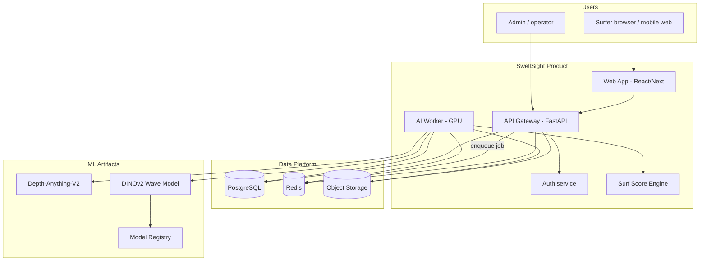
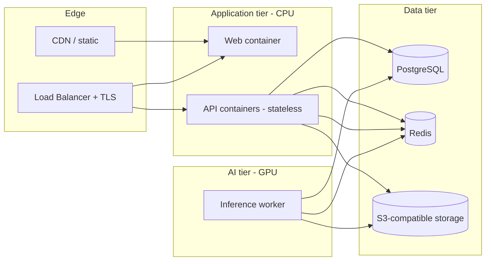
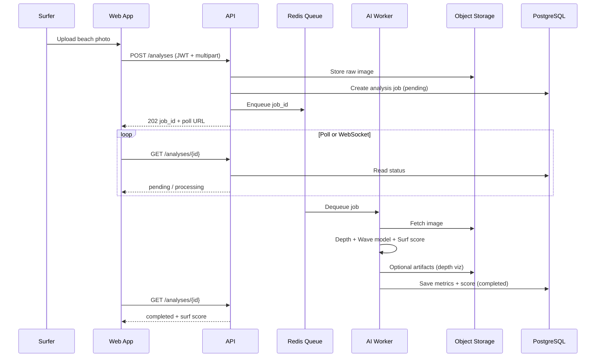
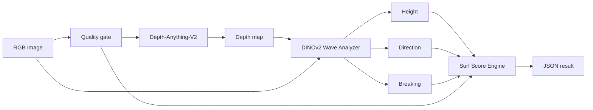

# SwellSight — System Roadmap & Architecture Plan

**Purpose:** Step-by-step plan from the current repository state to a **production-deployed** surfer-facing product: upload a beach photo → receive wave metrics and a **surf score** powered by a fully integrated AI pipeline.

**How to use this document:** Work phases in order unless noted. Mark tasks `- [x]` when done, `- [~]` when partial. Link PRs/issues to task IDs (e.g. `P2-T04`).

**Related docs:** [MODEL_GUIDE.md](MODEL_GUIDE.md), [RUN_LOCALLY.md](RUN_LOCALLY.md) (full stack A–Z), [START_HERE.md](START_HERE.md), [TRAINING_FROM_SCRATCH.md](TRAINING_FROM_SCRATCH.md).

---

## Progress summary (2026-05-21)

| Phase | Done | Partial | Open | % complete |
|-------|------|---------|------|------------|
| **P0** Foundation | **7** | 0 | 0 | **100%** |
| **P1** ML platform | **18** | 0 | 0 | **100%** |
| **P2** MLOps | **7** | 0 | 0 | **100%** |
| **P3** Backend | **28** | 0 | 1 | **97%** ([#61](https://github.com/ShalevAtsis/SwellSight/issues/61) backlog) |
| **P4** Web UI | **14** | 0 | 1 | **93%** ([#74](https://github.com/ShalevAtsis/SwellSight/issues/74) i18n) |
| **P5** Production | **10** | 1 | 13 | **~42%** |

**Product path today:** [RUN_LOCALLY.md](RUN_LOCALLY.md) or `docker compose -f deploy/docker-compose.yml up`. Metrics at `/metrics`. **Next:** staging (#80), CD (#83–#84), Grafana (#93), TLS (#86).

---

## Table of contents

1. [Vision & product scope](#1-vision--product-scope)
2. [Current state](#2-current-state)
3. [Target system architecture](#3-target-system-architecture)
4. [Client–server: do we need it?](#4-clientserver-do-we-need-it)
5. [Component catalog](#5-component-catalog)
6. [Technology recommendations](#6-technology-recommendations)
7. [Phased delivery plan](#7-phased-delivery-plan)
8. [Task checklist by phase](#8-task-checklist-by-phase)
9. [Data & API contracts](#9-data--api-contracts)
10. [Deployment architecture](#10-deployment-architecture)
11. [Risks, decisions, and open questions](#11-risks-decisions-and-open-questions)
12. [Suggested timeline](#12-suggested-timeline)

---

## 1. Vision & product scope

### Product (v1 production)


| Capability             | Description                                                     |
| ---------------------- | --------------------------------------------------------------- |
| **Beach photo upload** | Surfer uploads JPG/PNG from phone or desktop                    |
| **AI wave analysis**   | Automated depth + wave metrics (height, direction, breaking)    |
| **Surf score**         | Single 0–100 (or 1–10) score combining model outputs + rules/ML |
| **Account**            | Register, login, history of analyses                            |
| **Transparency**       | Confidence, warnings (fog, extreme swell), processing time      |


### “Fully AI” definition (for this project)

Not “AI marketing” — concrete engineering goals:


| Layer             | Today                                              | Target (“fully AI”)                                                   |
| ----------------- | -------------------------------------------------- | --------------------------------------------------------------------- |
| **Depth**         | Depth-Anything-V2 in code; Colab scripts for batch | Local/cloud batch + **cached depth** in DB; versioned model           |
| **Training data** | Manual + FLUX Colab                                | **Repeatable** synthetic pipeline (API/worker), dataset versioning    |
| **Wave model**    | Trainable; unified checkpoint path (recent fix)    | **MLOps**: eval gates, promoted models, A/B weights                   |
| **Surf score**    | Not implemented                                    | **Learned or calibrated** score from metrics + optional user feedback |
| **Inference**     | CLI + partial FastAPI                              | **GPU worker** behind queue; no user-facing ML in web tier            |
| **Human steps**   | Many manual paths in docs                          | Upload → score **without** notebooks or Drive                         |


---

## 2. Current state

### What exists (usable)

- **Model code:** `WaveAnalysisModel` / `DINOv2WaveAnalyzer` (shared weights), trainer, datasets
- **Pipeline:** `WaveAnalysisPipeline` (depth → wave metrics)
- **Scripts:** `train.py`, `inference.py`, `evaluate.py`, `check_training_readiness.py`
- **CLI:** `swellsight` (train / analyze / evaluate / check / serve)
- **API skeleton:** FastAPI `server.py`, `endpoints.py`, upload + analysis routes (in-memory cache)
- **Docs:** MODEL_GUIDE, training guides, 19 notebooks (research/Colab)
- **Tests:** Broad property tests; conftest path fix started

### Gaps (block production)

- **P5:** Split API/worker Dockerfiles, production CI/CD, observability, TLS, runbooks
- **P4 polish:** History thumbnails, forgot-password, share/export, formal a11y pass
- **P3:** `spots` schema, legacy `endpoints.py` refactor, JWT refresh, S3 pre-signed download URLs
- **P2:** Dataset versioning (DVC / manifest hash in registry)
- **P0:** Full test suite green on CI (#6)
- Colab still useful for **FLUX** at scale; local synthetic script exists for smaller runs

---

## 3. Target system architecture

### 3.1 Logical architecture (C4 — system context)




### 3.2 Container architecture (deployment view)




### 3.3 Request flow — analyze photo




### 3.4 AI pipeline (internal)




---

## 4. Client–server: do we need it?

**Yes.** A browser-only app cannot safely or practically:

- Hold GPU models and Hugging Face weights in the client
- Store user accounts and analysis history
- Process large images on mobile without draining battery
- Hide API keys and enforce rate limits

### Recommended split


| Tier                      | Responsibility                                     | Tech                                       |
| ------------------------- | -------------------------------------------------- | ------------------------------------------ |
| **Client**                | UI, upload, auth tokens, polling/WebSocket, charts | React or Next.js (TypeScript)              |
| **API server**            | REST/JSON, auth, validation, DB, enqueue jobs      | FastAPI (extend existing)                  |
| **AI worker**             | Depth + wave inference + score; GPU                | Python process (same `swellsight` package) |
| **Optional admin client** | Model version, metrics dashboard                   | Web or internal tools                      |


**Not needed for v1:** Native mobile apps (responsive web first), gRPC (REST + JSON is enough), separate microservices per ML stage (one worker is fine initially).

---

## 5. Component catalog


| ID  | Component                  | Owner phase | Description                                        |
| --- | -------------------------- | ----------- | -------------------------------------------------- |
| C01 | **Web App**                | P4          | Surfer UI: upload, results, history, profile       |
| C02 | **API Gateway**            | P3          | FastAPI app: routing, validation, OpenAPI          |
| C03 | **Auth**                   | P3          | JWT or session; register/login/refresh             |
| C04 | **PostgreSQL**             | P3          | Users, analyses, spots, model version metadata     |
| C05 | **Redis**                  | P3          | Job queue, rate limit, hot cache                   |
| C06 | **Object storage**         | P3          | Images, optional depth overlays                    |
| C07 | **AI Worker**              | P3          | Consumes jobs; runs `WaveAnalysisPipeline` + score |
| C08 | **Surf Score Engine**      | P3–P4       | Deterministic v1 → learned v2                      |
| C09 | **Model Registry**         | P2          | Checkpoint paths, version, metrics at promote      |
| C10 | **Training pipeline**      | P1–P2       | Local scripts → automated jobs (optional Phase 2+) |
| C11 | **Depth batch service**    | P1          | Local `extract_depth_maps` (refactor from Colab)   |
| C12 | **Synthetic data service** | P2          | FLUX generation worker (GPU-heavy, optional cloud) |
| C13 | **Observability**          | P5          | Logs, metrics, tracing, alerts                     |
| C14 | **CI/CD**                  | P5          | Test, build images, deploy staging/prod            |


---

## 6. Technology recommendations


| Area               | Recommendation                                           | Rationale                                    |
| ------------------ | -------------------------------------------------------- | -------------------------------------------- |
| API                | **FastAPI** (existing)                                   | Async, OpenAPI, team already has code        |
| DB                 | **PostgreSQL 15+**                                       | Relational, JSON columns for metrics         |
| Queue              | **Redis + ARQ** or **Celery**                            | Simple Python worker; ARQ fits async FastAPI |
| Storage            | **S3** / MinIO / Azure Blob                              | Standard for images                          |
| Auth               | **JWT** + refresh; or **Auth0/Clerk** if speed > control | Start JWT in-house for learning; swap later  |
| Frontend           | **Next.js 14+** (App Router)                             | SSR, API routes optional, good DX            |
| Styling            | **Tailwind CSS**                                         | Fast, consistent mobile UI                   |
| ML serving         | **In-process PyTorch** in worker                         | No separate TorchServe until scale demands   |
| Containers         | **Docker** + **docker-compose** dev                      | GPU worker image separate from API           |
| Prod orchestration | **Railway / Render / AWS ECS** or **k8s** later          | Start simple PaaS + one GPU node             |
| IaC (later)        | Terraform or Pulumi                                      | When multi-environment stable                |


---

## 7. Phased delivery plan


| Phase  | Name                 | Goal                                     | Exit criteria                                            |
| ------ | -------------------- | ---------------------------------------- | -------------------------------------------------------- |
| **P0** | Foundation           | Stable model path & docs                 | ✅ **86%** — [#1–#5,#7](https://github.com/ShalevAtsis/SwellSight/issues?q=label%3Aphase%3AP0+is%3Aclosed) closed; [#6](https://github.com/ShalevAtsis/SwellSight/issues/6) open |
| **P1** | ML platform complete | Fully repeatable AI training & inference | ✅ **~94%** — [#8–#25](https://github.com/ShalevAtsis/SwellSight/issues?q=label%3Aphase%3AP1+is%3Aclosed) closed (T03/T15 partial in doc) |
| **P2** | MLOps & data         | Versioned datasets and models            | ✅ **86%** — [#26–#29,#31–#32](https://github.com/ShalevAtsis/SwellSight/issues?q=label%3Aphase%3AP2+is%3Aclosed) closed; [#30](https://github.com/ShalevAtsis/SwellSight/issues/30) open |
| **P3** | Backend platform     | Multi-user API + worker + DB             | ✅ **~87%** — [#33–#61](https://github.com/ShalevAtsis/SwellSight/issues?q=label%3Aphase%3AP3+is%3Aclosed) except #36,#49,#61 |
| **P4** | Web product          | Surfer UI + surf score v1                | ✅ **~79%** — core flows closed; [#64](https://github.com/ShalevAtsis/SwellSight/issues/64), [#70–#75](https://github.com/ShalevAtsis/SwellSight/issues/70) open/partial |
| **P5** | Production           | Secure deploy, monitor, scale            | ⏳ **~8%** — [#79](https://github.com/ShalevAtsis/SwellSight/issues/79), [#81](https://github.com/ShalevAtsis/SwellSight/issues/81) partial; rest open |


---

## 8. Task checklist by phase

### Phase P0 — Foundation (maintenance)

*Aligns with recent cleanup; keep in sync as you go.* **6/7 done** — GitHub [#1–#5,#7](https://github.com/ShalevAtsis/SwellSight/issues?q=label%3Aphase%3AP0+is%3Aclosed) closed.

- [x] **P0-T01** Unify `WaveAnalysisModel` with inference analyzer ([#1](https://github.com/ShalevAtsis/SwellSight/issues/1))
- [x] **P0-T02** Fix YAML `ConfigManager` + `_base`_ inheritance ([#2](https://github.com/ShalevAtsis/SwellSight/issues/2))
- [x] **P0-T03** Implement `scripts/inference.py` and wire `swellsight` CLI ([#3](https://github.com/ShalevAtsis/SwellSight/issues/3))
- [x] **P0-T04** Add [MODEL_GUIDE.md](MODEL_GUIDE.md) ([#4](https://github.com/ShalevAtsis/SwellSight/issues/4))
- [x] **P0-T05** `pip install -e .` documented — [RUN_LOCALLY.md](RUN_LOCALLY.md), [MODEL_GUIDE.md](MODEL_GUIDE.md) ([#5](https://github.com/ShalevAtsis/SwellSight/issues/5))
- [ ] **P0-T06** Fix remaining test collection failures ([#6](https://github.com/ShalevAtsis/SwellSight/issues/6)) — *open*
- [x] **P0-T07** GitHub Actions CI — `.github/workflows/ci.yml` ([#7](https://github.com/ShalevAtsis/SwellSight/issues/7))

---

### Phase P1 — ML platform (“fully AI” core)

**Goal:** End-to-end ML without Colab; one command from raw images → trained checkpoint → inference metrics.  
**17/18 done** — GitHub [#8–#25](https://github.com/ShalevAtsis/SwellSight/issues?q=label%3Aphase%3AP1+is%3Aclosed) closed.

#### P1.A — Data & depth pipeline


| ID     | Status | Task                                  | Details                                                                |
| ------ | ------ | ------------------------------------- | ---------------------------------------------------------------------- |
| P1-T01 | ✅      | Refactor `extract_depth_maps.py`      | `scripts/extract_depth_maps.py` — local CLI ([#8](https://github.com/ShalevAtsis/SwellSight/issues/8)) |
| P1-T02 | ✅      | Standardize dataset layout            | `data/layout.py`, `validate_data_layout.py` ([#9](https://github.com/ShalevAtsis/SwellSight/issues/9)) |
| P1-T03 | ~      | Depth quality gate                    | `--min-quality` on extract; full train pipeline gate TBD ([#10](https://github.com/ShalevAtsis/SwellSight/issues/10)) |
| P1-T04 | ✅      | Dataset manifest                      | `manifest.py`, `build_dataset_manifest.py` ([#11](https://github.com/ShalevAtsis/SwellSight/issues/11)) |
| P1-T05 | ✅      | Integrate real depth in `WaveDataset` | `_depth.npy` loading ([#12](https://github.com/ShalevAtsis/SwellSight/issues/12)) |


#### P1.B — Training excellence


| ID     | Status | Task                            | Details                                                    |
| ------ | ------ | ------------------------------- | ---------------------------------------------------------- |
| P1-T06 | ✅      | Wire `MultiTaskLoss` in trainer | `trainer.py` ([#13](https://github.com/ShalevAtsis/SwellSight/issues/13)) |
| P1-T07 | ✅      | Wire LR scheduler               | `create_lr_scheduler` ([#14](https://github.com/ShalevAtsis/SwellSight/issues/14)) |
| P1-T08 | ✅      | Sim-to-real trainer mode        | `--sim-to-real` on `train.py` ([#15](https://github.com/ShalevAtsis/SwellSight/issues/15)) |
| P1-T09 | ✅      | Training callbacks              | Early stopping, TensorBoard ([#16](https://github.com/ShalevAtsis/SwellSight/issues/16)) |
| P1-T10 | ✅      | Export best checkpoint          | `checkpoints/best_model.pth` ([#17](https://github.com/ShalevAtsis/SwellSight/issues/17)) |
| P1-T11 | ✅      | Evaluation gate script          | `evaluation_gate.py` ([#18](https://github.com/ShalevAtsis/SwellSight/issues/18)) |


#### P1.C — Inference hardening


| ID     | Status | Task                                      | Details                                         |
| ------ | ------ | ----------------------------------------- | ----------------------------------------------- |
| P1-T12 | ✅      | Pipeline loads checkpoint from env/config | `SWELLSIGHT_CHECKPOINT` ([#19](https://github.com/ShalevAtsis/SwellSight/issues/19)) |
| P1-T13 | ✅      | Batch inference API internally            | `inference/batch.py` ([#20](https://github.com/ShalevAtsis/SwellSight/issues/20)) |
| P1-T14 | ✅      | Model warmup on worker start              | `runner.warmup()` in worker ([#21](https://github.com/ShalevAtsis/SwellSight/issues/21)) |
| P1-T15 | ~      | CPU/GPU fallback tests                    | `test_trainer_and_hardware.py`; expand docs ([#22](https://github.com/ShalevAtsis/SwellSight/issues/22)) |


#### P1.D — Synthetic data (optional but “full pipeline”)


| ID     | Status | Task                                            | Details                                        |
| ------ | ------ | ----------------------------------------------- | ---------------------------------------------- |
| P1-T16 | ✅      | Refactor `generate_synthetic_data.py` for local | `scripts/generate_synthetic_data.py` ([#23](https://github.com/ShalevAtsis/SwellSight/issues/23)) |
| P1-T17 | ✅      | Synthetic job config                            | `configs/synthetic.yaml` ([#24](https://github.com/ShalevAtsis/SwellSight/issues/24)) |
| P1-T18 | ✅      | Auto-label from depth geometry                  | `synthetic_generator` labels ([#25](https://github.com/ShalevAtsis/SwellSight/issues/25)) |


**P1 exit criteria:** Train on local data; evaluate; run `inference.py` with promoted checkpoint; depth maps generated locally; README metrics reproducible or honestly labeled “reference run”.

---

### Phase P2 — MLOps & model registry

**Goal:** Know *which* model is in staging/prod; reproduce training.  
**6/7 done** — [#26–#29,#31–#32](https://github.com/ShalevAtsis/SwellSight/issues?q=label%3Aphase%3AP2+is%3Aclosed) closed; [#30](https://github.com/ShalevAtsis/SwellSight/issues/30) open.


| ID     | Status | Task                                 | Details                                           |
| ------ | ------ | ------------------------------------ | ------------------------------------------------- |
| P2-T01 | ✅      | Define `models/registry.yaml`        | `models/registry.yaml` ([#26](https://github.com/ShalevAtsis/SwellSight/issues/26)) |
| P2-T02 | ✅      | Script `promote_model.py`            | `scripts/promote_model.py` ([#27](https://github.com/ShalevAtsis/SwellSight/issues/27)) |
| P2-T03 | ✅      | Pin dependency versions              | `requirements-lock.txt` ([#28](https://github.com/ShalevAtsis/SwellSight/issues/28)) |
| P2-T04 | ✅      | MLflow or simple JSON experiment log | `mlops/experiment.py` ([#29](https://github.com/ShalevAtsis/SwellSight/issues/29)) |
| P2-T05 | ⏳      | Dataset versioning                   | DVC / manifest hash — not implemented ([#30](https://github.com/ShalevAtsis/SwellSight/issues/30)) |
| P2-T06 | ✅      | Automated train smoke in CI          | `.github/workflows/train-smoke.yml` ([#31](https://github.com/ShalevAtsis/SwellSight/issues/31)) |
| P2-T07 | ✅      | Model card per version               | `docs/models/wave-v0.1.0.md` ([#32](https://github.com/ShalevAtsis/SwellSight/issues/32)) |


**P2 exit criteria:** Registry points to production candidate; training reproducible from manifest + config hash.

---

### Phase P3 — Backend platform (server)

**Goal:** Authenticated users; upload photo; async analysis; persisted results.  
**26/29 done** — [#33–#60](https://github.com/ShalevAtsis/SwellSight/issues?q=label%3Aphase%3AP3+is%3Aclosed) closed except [#36](https://github.com/ShalevAtsis/SwellSight/issues/36), [#49](https://github.com/ShalevAtsis/SwellSight/issues/49), [#61](https://github.com/ShalevAtsis/SwellSight/issues/61) (backlog).

#### P3.A — Database & domain model


| ID     | Status | Task                                     | Details                                                    |
| ------ | ------ | ---------------------------------------- | ---------------------------------------------------------- |
| P3-T01 | ✅      | Choose ORM: **SQLAlchemy 2.0** + Alembic | `db/`, `alembic/` ([#33](https://github.com/ShalevAtsis/SwellSight/issues/33)) |
| P3-T02 | ✅      | Schema: `users`                          | `db/models.py` ([#34](https://github.com/ShalevAtsis/SwellSight/issues/34)) |
| P3-T03 | ✅      | Schema: `analyses`                       | status, storage_key, scores ([#35](https://github.com/ShalevAtsis/SwellSight/issues/35)) |
| P3-T04 | ⏳      | Schema: `spots` (optional v1)            | Not implemented ([#36](https://github.com/ShalevAtsis/SwellSight/issues/36)) |
| P3-T05 | ✅      | Schema: `model_versions`                 | `ModelVersionRecord` ([#37](https://github.com/ShalevAtsis/SwellSight/issues/37)) |
| P3-T06 | ✅      | Seed + migration scripts                 | `001_initial_schema.py` ([#38](https://github.com/ShalevAtsis/SwellSight/issues/38)) |


#### P3.B — Auth & security


| ID     | Status | Task                                 | Details                          |
| ------ | ------ | ------------------------------------ | -------------------------------- |
| P3-T07 | ~      | Register / login / refresh endpoints | Login+register+JWT; refresh TBD ([#39](https://github.com/ShalevAtsis/SwellSight/issues/39)) |
| P3-T08 | ✅      | JWT middleware on protected routes   | `api/v1/deps.py` ([#40](https://github.com/ShalevAtsis/SwellSight/issues/40)) |
| P3-T09 | ✅      | Rate limiting per user/IP            | `RateLimitMiddleware` ([#41](https://github.com/ShalevAtsis/SwellSight/issues/41)) |
| P3-T10 | ✅      | Upload validation                    | `api/validation.py` ([#42](https://github.com/ShalevAtsis/SwellSight/issues/42)) |
| P3-T11 | ✅      | CORS config for web origin           | `platform/settings.py` ([#43](https://github.com/ShalevAtsis/SwellSight/issues/43)) |


#### P3.C — API design


| ID     | Status | Task                             | Details                                      |
| ------ | ------ | -------------------------------- | -------------------------------------------- |
| P3-T12 | ✅      | `POST /v1/analyses`              | 202 + queue ([#44](https://github.com/ShalevAtsis/SwellSight/issues/44)) |
| P3-T13 | ✅      | `GET /v1/analyses/{id}`          | Poll results ([#45](https://github.com/ShalevAtsis/SwellSight/issues/45)) |
| P3-T14 | ✅      | `GET /v1/analyses`               | History list ([#46](https://github.com/ShalevAtsis/SwellSight/issues/46)) |
| P3-T15 | ✅      | `GET /v1/health`                 | DB + Redis + queue ([#47](https://github.com/ShalevAtsis/SwellSight/issues/47)) |
| P3-T16 | ✅      | OpenAPI published                | `/docs` + `web/src/lib/api.ts` ([#48](https://github.com/ShalevAtsis/SwellSight/issues/48)) |
| P3-T17 | ✅      | Refactor existing `endpoints.py` | `get_pipeline(Request)` from app.state ([#49](https://github.com/ShalevAtsis/SwellSight/issues/49)) |
| P3-T18 | ✅      | Idempotency key on upload        | `Idempotency-Key` header ([#50](https://github.com/ShalevAtsis/SwellSight/issues/50)) |


#### P3.D — Worker & queue


| ID     | Status | Task                                     | Details                                   |
| ------ | ------ | ---------------------------------------- | ----------------------------------------- |
| P3-T19 | ✅      | Redis queue module                       | `jobs/queue.py` ([#51](https://github.com/ShalevAtsis/SwellSight/issues/51)) |
| P3-T20 | ✅      | Worker entrypoint `scripts/worker.py`    | Graceful shutdown ([#52](https://github.com/ShalevAtsis/SwellSight/issues/52)) |
| P3-T21 | ✅      | Job states                               | pending → processing → completed / failed ([#53](https://github.com/ShalevAtsis/SwellSight/issues/53)) |
| P3-T22 | ✅      | Retry + dead letter                      | BRPOPLPUSH + DLQ ([#54](https://github.com/ShalevAtsis/SwellSight/issues/54)) |
| P3-T23 | ~      | Store artifacts to object storage        | Local + S3 backend; no pre-signed URLs ([#55](https://github.com/ShalevAtsis/SwellSight/issues/55)) |
| P3-T24 | ✅      | Wire `ModelServer` / checkpoint from env | `SWELLSIGHT_CHECKPOINT`, skip flag ([#56](https://github.com/ShalevAtsis/SwellSight/issues/56)) |


#### P3.E — Surf Score Engine (v1)


| ID     | Status | Task                              | Details                                                         |
| ------ | ------ | --------------------------------- | --------------------------------------------------------------- |
| P3-T25 | ✅      | Define score spec                 | 0–100 documented ([#57](https://github.com/ShalevAtsis/SwellSight/issues/57)) |
| P3-T26 | ✅      | Implement `SurfScoreEngine`       | `scoring/engine.py` ([#58](https://github.com/ShalevAtsis/SwellSight/issues/58)) |
| P3-T27 | ✅      | Unit tests for score monotonicity | `tests/unit/test_surf_score.py` ([#59](https://github.com/ShalevAtsis/SwellSight/issues/59)) |
| P3-T28 | ✅      | Expose score in API response      | `surf_score`, `score_breakdown` ([#60](https://github.com/ShalevAtsis/SwellSight/issues/60)) |
| P3-T29 | 📋      | (v2 backlog) Learned score        | Not started ([#61](https://github.com/ShalevAtsis/SwellSight/issues/61)) |


**P3 exit criteria:** Postman/curl: login → upload → poll → get metrics + surf score; data in Postgres; worker runs without blocking API.

---

### Phase P4 — Web application (client)

**Goal:** Friendly UI for surfers; mobile-first.  
**11/14 done** — [#62–#72](https://github.com/ShalevAtsis/SwellSight/issues?q=label%3Aphase%3AP4+is%3Aclosed) closed; [#70–#75](https://github.com/ShalevAtsis/SwellSight/issues?q=label%3Aphase%3AP4+is%3Aopen) open/partial.

#### P4.A — App shell


| ID     | Status | Task                                    | Details                                                |
| ------ | ------ | --------------------------------------- | ------------------------------------------------------ |
| P4-T01 | ✅      | Create `web/` monorepo or separate repo | Next.js 14 `web/` ([#62](https://github.com/ShalevAtsis/SwellSight/issues/62)) |
| P4-T02 | ✅      | Design system                           | Tailwind ocean/swell tokens ([#63](https://github.com/ShalevAtsis/SwellSight/issues/63)) |
| P4-T03 | ~      | Auth pages                              | Login + register + forgot-password info page ([#64](https://github.com/ShalevAtsis/SwellSight/issues/64)) |
| P4-T04 | ✅      | API client from OpenAPI                 | `web/src/lib/api.ts` ([#65](https://github.com/ShalevAtsis/SwellSight/issues/65)) |


#### P4.B — Core flows


| ID     | Status | Task         | Details                                           |
| ------ | ------ | ------------ | ------------------------------------------------- |
| P4-T05 | ✅      | Landing page | `/` ([#66](https://github.com/ShalevAtsis/SwellSight/issues/66)) |
| P4-T06 | ✅      | Upload flow  | `UploadZone` + camera capture ([#67](https://github.com/ShalevAtsis/SwellSight/issues/67)) |
| P4-T07 | ✅      | Progress UI  | `useAnalysisPoll` 2s ([#68](https://github.com/ShalevAtsis/SwellSight/issues/68)) |
| P4-T08 | ✅      | Results page | Gauge + metrics + breakdown ([#69](https://github.com/ShalevAtsis/SwellSight/issues/69)) |
| P4-T09 | ✅      | History list | Thumbnails via `GET .../image` ([#70](https://github.com/ShalevAtsis/SwellSight/issues/70)) |
| P4-T10 | ✅      | Error states | Failed/timeout copy + worker hint ([#71](https://github.com/ShalevAtsis/SwellSight/issues/71)) |


#### P4.C — UX polish


| ID     | Status | Task                    | Details                               |
| ------ | ------ | ----------------------- | ------------------------------------- |
| P4-T11 | ✅      | Explain score breakdown | `ScoreBreakdownPanel` hints ([#72](https://github.com/ShalevAtsis/SwellSight/issues/72)) |
| P4-T12 | ✅      | Share result (optional) | Copy result link button ([#73](https://github.com/ShalevAtsis/SwellSight/issues/73)) |
| P4-T13 | 📋      | i18n backlog            | English only ([#74](https://github.com/ShalevAtsis/SwellSight/issues/74)) |
| P4-T14 | ⏳      | Accessibility           | Basic keyboard on upload; audit TBD ([#75](https://github.com/ShalevAtsis/SwellSight/issues/75)) |


**P4 exit criteria:** Staging URL: full journey without CLI; Lighthouse mobile acceptable.

---

### Phase P5 — Production deployment

**Goal:** Secure, observable, recoverable production.  
**1/24 done, 1 partial** — [#79](https://github.com/ShalevAtsis/SwellSight/issues/79) closed; [#81](https://github.com/ShalevAtsis/SwellSight/issues/81) partial; [#76–#99](https://github.com/ShalevAtsis/SwellSight/issues?q=label%3Aphase%3AP5+is%3Aopen) open.

#### P5.A — Containers & environments


| ID     | Status | Task                 | Details                                 |
| ------ | ------ | -------------------- | --------------------------------------- |
| P5-T01 | ✅      | `Dockerfile.api`     | `deploy/Dockerfile.api` ([#76](https://github.com/ShalevAtsis/SwellSight/issues/76)) |
| P5-T02 | ✅      | `Dockerfile.worker`  | `deploy/Dockerfile.worker` ([#77](https://github.com/ShalevAtsis/SwellSight/issues/77)) |
| P5-T03 | ✅      | `docker-compose.yml` | `deploy/docker-compose.yml` + MinIO ([#78](https://github.com/ShalevAtsis/SwellSight/issues/78)) |
| P5-T04 | ✅      | Env config           | `.env.example`, [RUN_LOCALLY.md](RUN_LOCALLY.md) ([#79](https://github.com/ShalevAtsis/SwellSight/issues/79)) |
| P5-T05 | ⏳      | Staging environment  | Not deployed ([#80](https://github.com/ShalevAtsis/SwellSight/issues/80)) |


#### P5.B — CI/CD


| ID     | Status | Task                             | Details            |
| ------ | ------ | -------------------------------- | ------------------ |
| P5-T06 | ✅      | CI: test + lint on PR            | `ci.yml` + platform integration tests ([#81](https://github.com/ShalevAtsis/SwellSight/issues/81)) |
| P5-T07 | ⏳      | CI: build images on main         | ([#82](https://github.com/ShalevAtsis/SwellSight/issues/82)) |
| P5-T08 | ⏳      | CD: deploy staging auto          | ([#83](https://github.com/ShalevAtsis/SwellSight/issues/83)) |
| P5-T09 | ⏳      | CD: deploy prod manual approve   | ([#84](https://github.com/ShalevAtsis/SwellSight/issues/84)) |
| P5-T10 | ⏳      | DB migrations in deploy pipeline | ([#85](https://github.com/ShalevAtsis/SwellSight/issues/85)) |


#### P5.C — Security & compliance


| ID     | Status | Task                   | Details                   |
| ------ | ------ | ---------------------- | ------------------------- |
| P5-T11 | ⏳      | TLS everywhere         | ([#86](https://github.com/ShalevAtsis/SwellSight/issues/86)) |
| P5-T12 | ⏳      | Secrets rotation doc   | ([#87](https://github.com/ShalevAtsis/SwellSight/issues/87)) |
| P5-T13 | ⏳      | Image retention policy | ([#88](https://github.com/ShalevAtsis/SwellSight/issues/88)) |
| P5-T14 | ⏳      | Privacy policy & ToS   | ([#89](https://github.com/ShalevAtsis/SwellSight/issues/89)) |
| P5-T15 | ⏳      | Dependency scanning    | ([#90](https://github.com/ShalevAtsis/SwellSight/issues/90)) |


#### P5.D — Observability & ops


| ID     | Status | Task               | Details                                                 |
| ------ | ------ | ------------------ | ------------------------------------------------------- |
| P5-T16 | ⏳      | Structured logging | ([#91](https://github.com/ShalevAtsis/SwellSight/issues/91)) |
| P5-T17 | ⏳      | Metrics            | ([#92](https://github.com/ShalevAtsis/SwellSight/issues/92)) |
| P5-T18 | ⏳      | Dashboards         | ([#93](https://github.com/ShalevAtsis/SwellSight/issues/93)) |
| P5-T19 | ⏳      | Alerts             | ([#94](https://github.com/ShalevAtsis/SwellSight/issues/94)) |
| P5-T20 | ✅      | Runbooks           | [RUNBOOK.md](ops/RUNBOOK.md) ([#95](https://github.com/ShalevAtsis/SwellSight/issues/95)) |


#### P5.E — Scale & cost (post-launch)


| ID     | Status | Task                    | Details                |
| ------ | ------ | ----------------------- | ---------------------- |
| P5-T21 | ⏳      | Horizontal API replicas | ([#96](https://github.com/ShalevAtsis/SwellSight/issues/96)) |
| P5-T22 | ⏳      | Multiple GPU workers    | ([#97](https://github.com/ShalevAtsis/SwellSight/issues/97)) |
| P5-T23 | ⏳      | CDN for static web      | ([#98](https://github.com/ShalevAtsis/SwellSight/issues/98)) |
| P5-T24 | ⏳      | Cost monitoring         | ([#99](https://github.com/ShalevAtsis/SwellSight/issues/99)) |


**P5 exit criteria:** Production URL live; on-call runbook; rollback tested; model promote path documented.

---

## 9. Data & API contracts

### 9.1 Analysis result (API JSON)

```json
{
  "id": "uuid",
  "status": "completed",
  "surf_score": 78,
  "score_breakdown": {
    "wave_quality": 0.82,
    "size_factor": 0.75,
    "confidence_factor": 0.91,
    "safety_penalty": 0.0
  },
  "wave_metrics": {
    "height_meters": 1.8,
    "height_feet": 5.9,
    "direction": "RIGHT",
    "breaking_type": "PLUNGING",
    "overall_confidence": 0.89
  },
  "warnings": [],
  "processing_time_ms": 2400,
  "model_version": "wave-v1.2.0",
  "created_at": "2026-05-20T12:00:00Z"
}
```

### 9.2 PostgreSQL tables (summary)

```sql
-- Conceptual; implement via Alembic
users (id, email, password_hash, created_at)
analyses (id, user_id, status, storage_key, result_json, surf_score, model_version, error_message, created_at, completed_at)
model_versions (id, name, checkpoint_uri, metrics_json, promoted_at, is_active)
```

### 9.3 Repository layout (target)

```
SwellSight/
├── src/swellsight/          # Python package (ML + API + scoring)
├── web/                     # Next.js frontend (new)
├── alembic/                 # DB migrations (new)
├── deploy/                  # Docker, compose, k8s manifests (new)
├── configs/
├── docs/
│   ├── MODEL_GUIDE.md
│   ├── SYSTEM_ROADMAP.md    # this file
│   └── ops/
├── scripts/
│   ├── train.py
│   ├── inference.py
│   └── worker.py            # new
└── tests/
```

---

## 10. Deployment architecture

### 10.1 Environment matrix


| Env            | API            | Worker        | DB                         | Storage        | GPU             |
| -------------- | -------------- | ------------- | -------------------------- | -------------- | --------------- |
| **local**      | docker-compose | 1 worker      | Postgres container         | MinIO          | optional NVIDIA |
| **staging**    | 1 replica      | 1 GPU node    | managed Postgres           | S3             | T4/L4 class     |
| **production** | 2+ replicas    | 1–2 GPU nodes | managed Postgres + backups | S3 + lifecycle | same or larger  |


### 10.2 Minimum production topology (cost-conscious)

1. **Vercel** or static host — Next.js web
2. **Railway/Render/Fly** — FastAPI (CPU)
3. **Single GPU VM** (Lambda Labs, RunPod, AWS `g4dn`) — worker
4. **Neon/Supabase/RDS** — Postgres
5. **Upstash** — Redis
6. **Cloudflare R2 / S3** — images

Upgrade to Kubernetes when: >1000 analyses/day or multi-region needed.

---

## 11. Risks, decisions, and open questions


| #   | Risk / decision                        | Mitigation                                         | Decide by   |
| --- | -------------------------------------- | -------------------------------------------------- | ----------- |
| D1  | GPU cost in production                 | Queue + batch; cache depth for same beach angle    | P3          |
| D2  | FLUX synthetic too heavy for self-host | Run generation offline; ship pretrained checkpoint | P1-T16      |
| D3  | Surf score distrust                    | Show breakdown + confidence; iterate formula       | P3-T25      |
| D4  | Model drift on new beaches             | Feedback loop; finetune pipeline (P2+)             | Post-launch |
| D5  | Monorepo vs split web repo             | **Monorepo** recommended for small team            | P4 start    |
| D6  | Auth provider                          | JWT in-house v1; Clerk if no security expertise    | P3-T07      |


### Open questions (fill in as you decide)


| Question                      | Options          | Your choice |
| ----------------------------- | ---------------- | ----------- |
| Surf score scale?             | 0–100 vs 1–10    | *0-100*     |
| Free tier limits?             | N analyses/day   | *5*         |
| Store user photos how long?   | 7 / 30 / 90 days | *7*         |
| Public API for third parties? | v2               | *v2*        |


---

## 12. Suggested timeline

Rough calendar for a **3-person ML team** (adjust parallelism):


| Weeks | Phase                | Milestone                           |
| ----- | -------------------- | ----------------------------------- |
| 1–2   | P0 finish + P1 start | Tests green; local depth script     |
| 3–6   | P1                   | Trained checkpoint + eval gates     |
| 7–8   | P2                   | Model registry + reproducible train |
| 9–12  | P3                   | API + worker + DB + score v1        |
| 13–16 | P4                   | Web UI staging demo                 |
| 17–20 | P5                   | Production launch + monitoring      |


**Parallel track:** UI mockups can start during P3 (week 9) using mocked API.

---

## GitHub tracking

Issues are live on **[ShalevAtsis/SwellSight](https://github.com/ShalevAtsis/SwellSight/issues)**:

| Item | Closed | Open / backlog |
|------|--------|----------------|
| **Epic** | — | [#100 — P0→P5 roadmap](https://github.com/ShalevAtsis/SwellSight/issues/100) |
| **P0** | [#1–#5,#7](https://github.com/ShalevAtsis/SwellSight/issues?q=label%3Aphase%3AP0+is%3Aclosed) | [#6](https://github.com/ShalevAtsis/SwellSight/issues/6) |
| **P1** | [#8–#25](https://github.com/ShalevAtsis/SwellSight/issues?q=label%3Aphase%3AP1+is%3Aclosed) | — |
| **P2** | [#26–#29,#31–#32](https://github.com/ShalevAtsis/SwellSight/issues?q=label%3Aphase%3AP2+is%3Aclosed) | [#30](https://github.com/ShalevAtsis/SwellSight/issues/30) |
| **P3** | [#33–#35,#37–#48,#50–#60](https://github.com/ShalevAtsis/SwellSight/issues?q=label%3Aphase%3AP3+is%3Aclosed) | [#36](https://github.com/ShalevAtsis/SwellSight/issues/36), [#49](https://github.com/ShalevAtsis/SwellSight/issues/49), [#61](https://github.com/ShalevAtsis/SwellSight/issues/61) backlog |
| **P4** | [#62–#63,#65–#69,#72](https://github.com/ShalevAtsis/SwellSight/issues?q=label%3Aphase%3AP4+is%3Aclosed) | [#64](https://github.com/ShalevAtsis/SwellSight/issues/64), [#70](https://github.com/ShalevAtsis/SwellSight/issues/70)–[#71](https://github.com/ShalevAtsis/SwellSight/issues/71), [#73](https://github.com/ShalevAtsis/SwellSight/issues/73)–[#75](https://github.com/ShalevAtsis/SwellSight/issues/75) |
| **P5** | [#79](https://github.com/ShalevAtsis/SwellSight/issues/79) | [#76–#78,#80–#99](https://github.com/ShalevAtsis/SwellSight/issues?q=label%3Aphase%3AP5+is%3Aopen) |

**Legend:** ✅ done · ~ partial · ⏳ not started · 📋 v2 backlog

Title format: `[P1-T01] Short description`. Milestones: `P0: Foundation` … `P5: Production`.

Re-create issues (if needed): `python scripts/create_roadmap_issues.py`

---

## Next action (immediate)

1. **Smoke test:** `docker compose -f deploy/docker-compose.yml up --build` — see [RUNBOOK.md](ops/RUNBOOK.md).
2. **P5 staging:** [#80](https://github.com/ShalevAtsis/SwellSight/issues/80) deploy to Railway/Render + GPU worker host.
3. **P5 CD:** [#83](https://github.com/ShalevAtsis/SwellSight/issues/83)–[#84](https://github.com/ShalevAtsis/SwellSight/issues/84) automated deploy pipelines.
4. **P5 observability:** [#93](https://github.com/ShalevAtsis/SwellSight/issues/93) Grafana dashboards wired to `/metrics`.

**Work order:** Staging E2E → production CD → observability & compliance polish.

---

*Document version: 1.1 — 2026-05-21 (progress sync)*