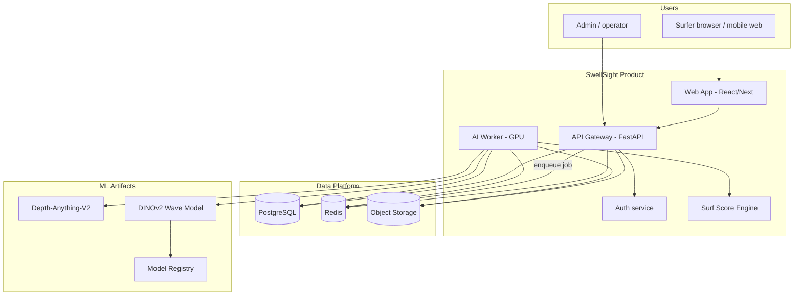
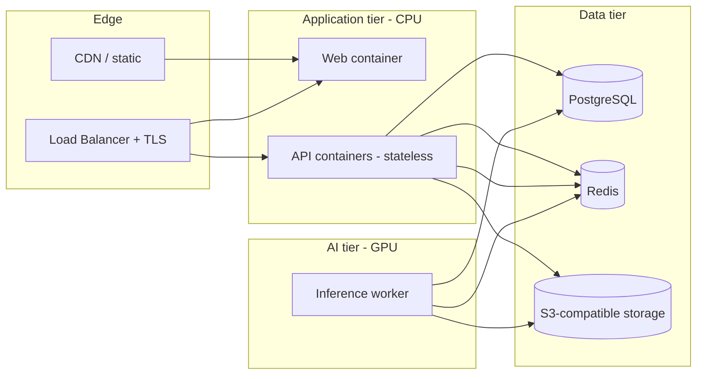
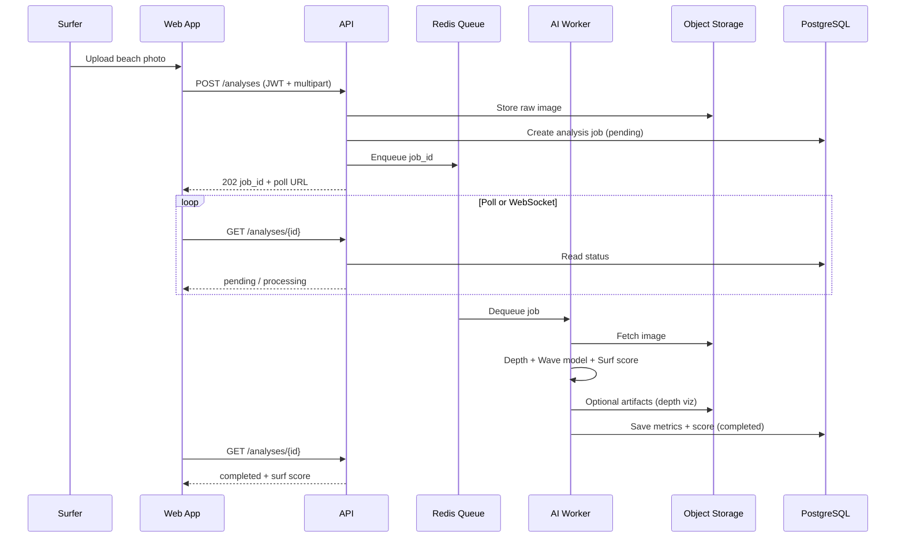
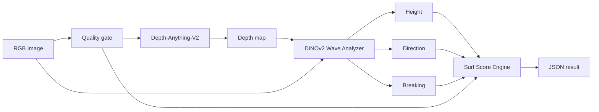

# SwellSight — System Roadmap & Architecture Plan

**Purpose:** Step-by-step plan from the current repository state to a **production-deployed** surfer-facing product: upload a beach photo → receive wave metrics and a **surf score** powered by a fully integrated AI pipeline.

**How to use this document:** Work phases in order unless noted. Mark tasks `- [x]` when done. Link PRs/issues to task IDs (e.g. `P2-T04`).

**Related docs:** [MODEL_GUIDE.md](MODEL_GUIDE.md) (model commands today), [START_HERE.md](START_HERE.md), [TRAINING_FROM_SCRATCH.md](TRAINING_FROM_SCRATCH.md).

---

## Table of contents

1. [Vision & product scope](#1-vision--product-scope)
2. [Current state](#2-current-state)
3. [Target system architecture](#3-target-system-architecture)
4. [Client–server: do we need it?](#4-clientserver-do-we-need-it)
5. [Component catalog](#5-component-catalog)
6. [Technology recommendations](#6-technology-recommendations)
7. [Phased delivery plan](#7-phased-delivery-plan)
8. [Task checklist by phase](#8-task-checklist-by-phase)
9. [Data & API contracts](#9-data--api-contracts)
10. [Deployment architecture](#10-deployment-architecture)
11. [Risks, decisions, and open questions](#11-risks-decisions-and-open-questions)
12. [Suggested timeline](#12-suggested-timeline)

---

## 1. Vision & product scope

### Product (v1 production)


| Capability             | Description                                                     |
| ---------------------- | --------------------------------------------------------------- |
| **Beach photo upload** | Surfer uploads JPG/PNG from phone or desktop                    |
| **AI wave analysis**   | Automated depth + wave metrics (height, direction, breaking)    |
| **Surf score**         | Single 0–100 (or 1–10) score combining model outputs + rules/ML |
| **Account**            | Register, login, history of analyses                            |
| **Transparency**       | Confidence, warnings (fog, extreme swell), processing time      |


### “Fully AI” definition (for this project)

Not “AI marketing” — concrete engineering goals:


| Layer             | Today                                              | Target (“fully AI”)                                                   |
| ----------------- | -------------------------------------------------- | --------------------------------------------------------------------- |
| **Depth**         | Depth-Anything-V2 in code; Colab scripts for batch | Local/cloud batch + **cached depth** in DB; versioned model           |
| **Training data** | Manual + FLUX Colab                                | **Repeatable** synthetic pipeline (API/worker), dataset versioning    |
| **Wave model**    | Trainable; unified checkpoint path (recent fix)    | **MLOps**: eval gates, promoted models, A/B weights                   |
| **Surf score**    | Not implemented                                    | **Learned or calibrated** score from metrics + optional user feedback |
| **Inference**     | CLI + partial FastAPI                              | **GPU worker** behind queue; no user-facing ML in web tier            |
| **Human steps**   | Many manual paths in docs                          | Upload → score **without** notebooks or Drive                         |


---

## 2. Current state

### What exists (usable)

- **Model code:** `WaveAnalysisModel` / `DINOv2WaveAnalyzer` (shared weights), trainer, datasets
- **Pipeline:** `WaveAnalysisPipeline` (depth → wave metrics)
- **Scripts:** `train.py`, `inference.py`, `evaluate.py`, `check_training_readiness.py`
- **CLI:** `swellsight` (train / analyze / evaluate / check / serve)
- **API skeleton:** FastAPI `server.py`, `endpoints.py`, upload + analysis routes (in-memory cache)
- **Docs:** MODEL_GUIDE, training guides, 19 notebooks (research/Colab)
- **Tests:** Broad property tests; conftest path fix started

### Gaps (block production)

- No **user DB**, auth, or persistent storage for uploads/results
- No **job queue** (long inference blocks HTTP)
- No **surf score** product logic
- No **web UI**
- Colab-tied **depth/synthetic** scripts
- No **CI/CD**, containers, or environment parity
- Trainer missing sim-to-real orchestration, schedulers, `MultiTaskLoss` wiring
- API not integrated with checkpoint config / auth / rate limits for real traffic

---

## 3. Target system architecture

### 3.1 Logical architecture (C4 — system context)




### 3.2 Container architecture (deployment view)




### 3.3 Request flow — analyze photo




### 3.4 AI pipeline (internal)




---

## 4. Client–server: do we need it?

**Yes.** A browser-only app cannot safely or practically:

- Hold GPU models and Hugging Face weights in the client
- Store user accounts and analysis history
- Process large images on mobile without draining battery
- Hide API keys and enforce rate limits

### Recommended split


| Tier                      | Responsibility                                     | Tech                                       |
| ------------------------- | -------------------------------------------------- | ------------------------------------------ |
| **Client**                | UI, upload, auth tokens, polling/WebSocket, charts | React or Next.js (TypeScript)              |
| **API server**            | REST/JSON, auth, validation, DB, enqueue jobs      | FastAPI (extend existing)                  |
| **AI worker**             | Depth + wave inference + score; GPU                | Python process (same `swellsight` package) |
| **Optional admin client** | Model version, metrics dashboard                   | Web or internal tools                      |


**Not needed for v1:** Native mobile apps (responsive web first), gRPC (REST + JSON is enough), separate microservices per ML stage (one worker is fine initially).

---

## 5. Component catalog


| ID  | Component                  | Owner phase | Description                                        |
| --- | -------------------------- | ----------- | -------------------------------------------------- |
| C01 | **Web App**                | P4          | Surfer UI: upload, results, history, profile       |
| C02 | **API Gateway**            | P3          | FastAPI app: routing, validation, OpenAPI          |
| C03 | **Auth**                   | P3          | JWT or session; register/login/refresh             |
| C04 | **PostgreSQL**             | P3          | Users, analyses, spots, model version metadata     |
| C05 | **Redis**                  | P3          | Job queue, rate limit, hot cache                   |
| C06 | **Object storage**         | P3          | Images, optional depth overlays                    |
| C07 | **AI Worker**              | P3          | Consumes jobs; runs `WaveAnalysisPipeline` + score |
| C08 | **Surf Score Engine**      | P3–P4       | Deterministic v1 → learned v2                      |
| C09 | **Model Registry**         | P2          | Checkpoint paths, version, metrics at promote      |
| C10 | **Training pipeline**      | P1–P2       | Local scripts → automated jobs (optional Phase 2+) |
| C11 | **Depth batch service**    | P1          | Local `extract_depth_maps` (refactor from Colab)   |
| C12 | **Synthetic data service** | P2          | FLUX generation worker (GPU-heavy, optional cloud) |
| C13 | **Observability**          | P5          | Logs, metrics, tracing, alerts                     |
| C14 | **CI/CD**                  | P5          | Test, build images, deploy staging/prod            |


---

## 6. Technology recommendations


| Area               | Recommendation                                           | Rationale                                    |
| ------------------ | -------------------------------------------------------- | -------------------------------------------- |
| API                | **FastAPI** (existing)                                   | Async, OpenAPI, team already has code        |
| DB                 | **PostgreSQL 15+**                                       | Relational, JSON columns for metrics         |
| Queue              | **Redis + ARQ** or **Celery**                            | Simple Python worker; ARQ fits async FastAPI |
| Storage            | **S3** / MinIO / Azure Blob                              | Standard for images                          |
| Auth               | **JWT** + refresh; or **Auth0/Clerk** if speed > control | Start JWT in-house for learning; swap later  |
| Frontend           | **Next.js 14+** (App Router)                             | SSR, API routes optional, good DX            |
| Styling            | **Tailwind CSS**                                         | Fast, consistent mobile UI                   |
| ML serving         | **In-process PyTorch** in worker                         | No separate TorchServe until scale demands   |
| Containers         | **Docker** + **docker-compose** dev                      | GPU worker image separate from API           |
| Prod orchestration | **Railway / Render / AWS ECS** or **k8s** later          | Start simple PaaS + one GPU node             |
| IaC (later)        | Terraform or Pulumi                                      | When multi-environment stable                |


---

## 7. Phased delivery plan


| Phase  | Name                 | Goal                                     | Exit criteria                                            |
| ------ | -------------------- | ---------------------------------------- | -------------------------------------------------------- |
| **P0** | Foundation           | Stable model path & docs                 | ✅ Mostly done — maintain per MODEL_GUIDE                 |
| **P1** | ML platform complete | Fully repeatable AI training & inference | Eval gates pass; local depth script; promoted checkpoint |
| **P2** | MLOps & data         | Versioned datasets and models            | Registry + reproducible train run in CI                  |
| **P3** | Backend platform     | Multi-user API + worker + DB             | Upload → async result persisted                          |
| **P4** | Web product          | Surfer UI + surf score v1                | E2E demo on staging                                      |
| **P5** | Production           | Secure deploy, monitor, scale            | Prod URL, SLAs, runbooks                                 |


---

## 8. Task checklist by phase

### Phase P0 — Foundation (maintenance)

*Aligns with recent cleanup; keep in sync as you go.*

- P0-T01 Unify `WaveAnalysisModel` with inference analyzer (shared checkpoint)
- P0-T02 Fix YAML `ConfigManager` + `_base`_ inheritance
- P0-T03 Implement `scripts/inference.py` and wire `swellsight` CLI
- P0-T04 Add [MODEL_GUIDE.md](MODEL_GUIDE.md)
- P0-T05 `pip install -e .` verified on Windows + Linux (document in MODEL_GUIDE)
- P0-T06 Fix remaining test collection failures (grep `sys.path` hacks)
- P0-T07 Add GitHub Actions: lint + unit tests on PR

---

### Phase P1 — ML platform (“fully AI” core)

**Goal:** End-to-end ML without Colab; one command from raw images → trained checkpoint → inference metrics.

#### P1.A — Data & depth pipeline


| ID     | Task                                  | Details                                                                |
| ------ | ------------------------------------- | ---------------------------------------------------------------------- |
| P1-T01 | Refactor `extract_depth_maps.py`      | Remove Colab/Drive paths; CLI: `--input`, `--output`, `--gpu`          |
| P1-T02 | Standardize dataset layout            | Document + validate `data/raw`, `data/depth_maps`, `data/processed`    |
| P1-T03 | Depth quality gate                    | Reuse `quality_validation` / `data_validator` in pipeline before train |
| P1-T04 | Dataset manifest                      | `datasets/manifest.json` (paths, labels, split, version)               |
| P1-T05 | Integrate real depth in `WaveDataset` | Load `_depth.npy` when present instead of zeros                        |


#### P1.B — Training excellence


| ID     | Task                            | Details                                                    |
| ------ | ------------------------------- | ---------------------------------------------------------- |
| P1-T06 | Wire `MultiTaskLoss` in trainer | Replace inline MSE/CE; config loss weights                 |
| P1-T07 | Wire LR scheduler               | `create_lr_scheduler` + warmup per config                  |
| P1-T08 | Sim-to-real trainer mode        | Synthetic pretrain → real finetune phases in one CLI flag  |
| P1-T09 | Training callbacks              | Early stopping, TensorBoard/W&B optional                   |
| P1-T10 | Export best checkpoint          | Always write `checkpoints/best_model.pth` + `metrics.json` |
| P1-T11 | Evaluation gate script          | Fail CI if MAE/accuracy below thresholds (configurable)    |


#### P1.C — Inference hardening


| ID     | Task                                      | Details                                         |
| ------ | ----------------------------------------- | ----------------------------------------------- |
| P1-T12 | Pipeline loads checkpoint from env/config | `SWELLSIGHT_CHECKPOINT` + inference.yaml        |
| P1-T13 | Batch inference API internally            | Worker-ready function: list of images → results |
| P1-T14 | Model warmup on worker start              | Avoid cold-start timeout on first user          |
| P1-T15 | CPU/GPU fallback tests                    | Document limits in MODEL_GUIDE                  |


#### P1.D — Synthetic data (optional but “full pipeline”)


| ID     | Task                                            | Details                                        |
| ------ | ----------------------------------------------- | ---------------------------------------------- |
| P1-T16 | Refactor `generate_synthetic_data.py` for local | HF token via env; no `google.colab`            |
| P1-T17 | Synthetic job config                            | YAML: prompts, count, controlnet scale         |
| P1-T18 | Auto-label from depth geometry                  | Tie into existing `synthetic_generator` labels |


**P1 exit criteria:** Train on local data; evaluate; run `inference.py` with promoted checkpoint; depth maps generated locally; README metrics reproducible or honestly labeled “reference run”.

---

### Phase P2 — MLOps & model registry

**Goal:** Know *which* model is in staging/prod; reproduce training.


| ID     | Task                                 | Details                                           |
| ------ | ------------------------------------ | ------------------------------------------------- |
| P2-T01 | Define `models/registry.yaml`        | version, path, metrics, data_manifest_id, git_sha |
| P2-T02 | Script `promote_model.py`            | Copy checkpoint + update registry                 |
| P2-T03 | Pin dependency versions              | `requirements/*.txt` lock for training/inference  |
| P2-T04 | MLflow or simple JSON experiment log | Params, metrics, artifact path                    |
| P2-T05 | Dataset versioning                   | DVC or manifest hash in registry                  |
| P2-T06 | Automated train smoke in CI          | Dummy data, 1 epoch, on GPU runner optional       |
| P2-T07 | Model card per version               | `docs/models/vX.md` — limits, metrics, bias notes |


**P2 exit criteria:** Registry points to production candidate; training reproducible from manifest + config hash.

---

### Phase P3 — Backend platform (server)

**Goal:** Authenticated users; upload photo; async analysis; persisted results.

#### P3.A — Database & domain model


| ID     | Task                                     | Details                                                    |
| ------ | ---------------------------------------- | ---------------------------------------------------------- |
| P3-T01 | Choose ORM: **SQLAlchemy 2.0** + Alembic | Migrations from day one                                    |
| P3-T02 | Schema: `users`                          | id, email, password_hash, created_at                       |
| P3-T03 | Schema: `analyses`                       | user_id, status, image_url, result_json, score, timestamps |
| P3-T04 | Schema: `spots` (optional v1)            | name, lat/lon — for future spot-based cams                 |
| P3-T05 | Schema: `model_versions`                 | registry sync for audit                                    |
| P3-T06 | Seed + migration scripts                 | `alembic upgrade head`                                     |


#### P3.B — Auth & security


| ID     | Task                                 | Details                          |
| ------ | ------------------------------------ | -------------------------------- |
| P3-T07 | Register / login / refresh endpoints | bcrypt or argon2 passwords       |
| P3-T08 | JWT middleware on protected routes   |                                  |
| P3-T09 | Rate limiting per user/IP            | Redis sliding window             |
| P3-T10 | Upload validation                    | Max size, MIME, image dimensions |
| P3-T11 | CORS config for web origin           | Staging + prod URLs              |


#### P3.C — API design


| ID     | Task                             | Details                                      |
| ------ | -------------------------------- | -------------------------------------------- |
| P3-T12 | `POST /v1/analyses`              | multipart upload → job_id                    |
| P3-T13 | `GET /v1/analyses/{id}`          | status + result when complete                |
| P3-T14 | `GET /v1/analyses`               | user history paginated                       |
| P3-T15 | `GET /v1/health`                 | API + DB + queue depth                       |
| P3-T16 | OpenAPI published                | Generate TS client for frontend              |
| P3-T17 | Refactor existing `endpoints.py` | Remove fragile frame inspection for pipeline |
| P3-T18 | Idempotency key on upload        | Optional duplicate prevention                |


#### P3.D — Worker & queue


| ID     | Task                                     | Details                                   |
| ------ | ---------------------------------------- | ----------------------------------------- |
| P3-T19 | Redis queue module                       | `swellsight/jobs/` package                |
| P3-T20 | Worker entrypoint `scripts/worker.py`    | Loop: dequeue → pipeline → save           |
| P3-T21 | Job states                               | pending → processing → completed / failed |
| P3-T22 | Retry + dead letter                      | 3 retries; log failure reason             |
| P3-T23 | Store artifacts to object storage        | Pre-signed URLs for client download       |
| P3-T24 | Wire `ModelServer` / checkpoint from env | Production model version                  |


#### P3.E — Surf Score Engine (v1)


| ID     | Task                              | Details                                                         |
| ------ | --------------------------------- | --------------------------------------------------------------- |
| P3-T25 | Define score spec                 | 0–100; inputs: height, direction, breaking, confidence, quality |
| P3-T26 | Implement `SurfScoreEngine`       | `src/swellsight/scoring/` — weighted formula + caps             |
| P3-T27 | Unit tests for score monotonicity | e.g. higher clean swell → not lower score                       |
| P3-T28 | Expose score in API response      | `surf_score`, `score_breakdown`                                 |
| P3-T29 | (v2 backlog) Learned score        | Train regressor on user ratings                                 |


**P3 exit criteria:** Postman/curl: login → upload → poll → get metrics + surf score; data in Postgres; worker runs without blocking API.

---

### Phase P4 — Web application (client)

**Goal:** Friendly UI for surfers; mobile-first.

#### P4.A — App shell


| ID     | Task                                    | Details                                                |
| ------ | --------------------------------------- | ------------------------------------------------------ |
| P4-T01 | Create `web/` monorepo or separate repo | Next.js + TypeScript                                   |
| P4-T02 | Design system                           | Colors, typography, surf brand; Figma or inline tokens |
| P4-T03 | Auth pages                              | Login, register, forgot password                       |
| P4-T04 | API client from OpenAPI                 | Generated hooks or fetch wrapper                       |


#### P4.B — Core flows


| ID     | Task         | Details                                           |
| ------ | ------------ | ------------------------------------------------- |
| P4-T05 | Landing page | Value prop + CTA                                  |
| P4-T06 | Upload flow  | Drag-drop, camera capture on mobile               |
| P4-T07 | Progress UI  | Poll or WebSocket while analyzing                 |
| P4-T08 | Results page | Height, direction, breaking, **surf score** gauge |
| P4-T09 | History list | Past analyses with thumbnails                     |
| P4-T10 | Error states | Low quality image, timeout, model warning         |


#### P4.C — UX polish


| ID     | Task                    | Details                               |
| ------ | ----------------------- | ------------------------------------- |
| P4-T11 | Explain score breakdown | Tooltips: what affects score          |
| P4-T12 | Share result (optional) | Link or image export                  |
| P4-T13 | i18n backlog            | English first; Hebrew if needed later |
| P4-T14 | Accessibility           | WCAG basics, keyboard nav             |


**P4 exit criteria:** Staging URL: full journey without CLI; Lighthouse mobile acceptable.

---

### Phase P5 — Production deployment

**Goal:** Secure, observable, recoverable production.

#### P5.A — Containers & environments


| ID     | Task                 | Details                                 |
| ------ | -------------------- | --------------------------------------- |
| P5-T01 | `Dockerfile.api`     | Slim Python, no GPU                     |
| P5-T02 | `Dockerfile.worker`  | CUDA base + model cache volume          |
| P5-T03 | `docker-compose.yml` | api + worker + postgres + redis + minio |
| P5-T04 | Env config           | `.env.example`; secrets via platform    |
| P5-T05 | Staging environment  | Parity with prod, smaller GPU           |


#### P5.B — CI/CD


| ID     | Task                             | Details            |
| ------ | -------------------------------- | ------------------ |
| P5-T06 | CI: test + lint on PR            |                    |
| P5-T07 | CI: build images on main         | Tag `sha` + semver |
| P5-T08 | CD: deploy staging auto          |                    |
| P5-T09 | CD: deploy prod manual approve   |                    |
| P5-T10 | DB migrations in deploy pipeline | Alembic job        |


#### P5.C — Security & compliance


| ID     | Task                   | Details                   |
| ------ | ---------------------- | ------------------------- |
| P5-T11 | TLS everywhere         | LB terminates HTTPS       |
| P5-T12 | Secrets rotation doc   | HF token, DB, JWT secret  |
| P5-T13 | Image retention policy | Delete raw after N days   |
| P5-T14 | Privacy policy & ToS   | User uploads beach photos |
| P5-T15 | Dependency scanning    | Dependabot / Snyk         |


#### P5.D — Observability & ops


| ID     | Task               | Details                                                 |
| ------ | ------------------ | ------------------------------------------------------- |
| P5-T16 | Structured logging | JSON logs, correlation id per job                       |
| P5-T17 | Metrics            | Prometheus: latency, queue depth, GPU util              |
| P5-T18 | Dashboards         | Grafana — API + worker                                  |
| P5-T19 | Alerts             | Failed jobs, queue backlog, error rate                  |
| P5-T20 | Runbooks           | `docs/ops/RUNBOOK.md` — deploy, rollback, model promote |


#### P5.E — Scale & cost (post-launch)


| ID     | Task                    | Details                |
| ------ | ----------------------- | ---------------------- |
| P5-T21 | Horizontal API replicas | Stateless              |
| P5-T22 | Multiple GPU workers    | Queue consumers        |
| P5-T23 | CDN for static web      |                        |
| P5-T24 | Cost monitoring         | GPU hours per analysis |


**P5 exit criteria:** Production URL live; on-call runbook; rollback tested; model promote path documented.

---

## 9. Data & API contracts

### 9.1 Analysis result (API JSON)

```json
{
  "id": "uuid",
  "status": "completed",
  "surf_score": 78,
  "score_breakdown": {
    "wave_quality": 0.82,
    "size_factor": 0.75,
    "confidence_factor": 0.91,
    "safety_penalty": 0.0
  },
  "wave_metrics": {
    "height_meters": 1.8,
    "height_feet": 5.9,
    "direction": "RIGHT",
    "breaking_type": "PLUNGING",
    "overall_confidence": 0.89
  },
  "warnings": [],
  "processing_time_ms": 2400,
  "model_version": "wave-v1.2.0",
  "created_at": "2026-05-20T12:00:00Z"
}
```

### 9.2 PostgreSQL tables (summary)

```sql
-- Conceptual; implement via Alembic
users (id, email, password_hash, created_at)
analyses (id, user_id, status, storage_key, result_json, surf_score, model_version, error_message, created_at, completed_at)
model_versions (id, name, checkpoint_uri, metrics_json, promoted_at, is_active)
```

### 9.3 Repository layout (target)

```
SwellSight/
├── src/swellsight/          # Python package (ML + API + scoring)
├── web/                     # Next.js frontend (new)
├── alembic/                 # DB migrations (new)
├── deploy/                  # Docker, compose, k8s manifests (new)
├── configs/
├── docs/
│   ├── MODEL_GUIDE.md
│   ├── SYSTEM_ROADMAP.md    # this file
│   └── ops/
├── scripts/
│   ├── train.py
│   ├── inference.py
│   └── worker.py            # new
└── tests/
```

---

## 10. Deployment architecture

### 10.1 Environment matrix


| Env            | API            | Worker        | DB                         | Storage        | GPU             |
| -------------- | -------------- | ------------- | -------------------------- | -------------- | --------------- |
| **local**      | docker-compose | 1 worker      | Postgres container         | MinIO          | optional NVIDIA |
| **staging**    | 1 replica      | 1 GPU node    | managed Postgres           | S3             | T4/L4 class     |
| **production** | 2+ replicas    | 1–2 GPU nodes | managed Postgres + backups | S3 + lifecycle | same or larger  |


### 10.2 Minimum production topology (cost-conscious)

1. **Vercel** or static host — Next.js web
2. **Railway/Render/Fly** — FastAPI (CPU)
3. **Single GPU VM** (Lambda Labs, RunPod, AWS `g4dn`) — worker
4. **Neon/Supabase/RDS** — Postgres
5. **Upstash** — Redis
6. **Cloudflare R2 / S3** — images

Upgrade to Kubernetes when: >1000 analyses/day or multi-region needed.

---

## 11. Risks, decisions, and open questions


| #   | Risk / decision                        | Mitigation                                         | Decide by   |
| --- | -------------------------------------- | -------------------------------------------------- | ----------- |
| D1  | GPU cost in production                 | Queue + batch; cache depth for same beach angle    | P3          |
| D2  | FLUX synthetic too heavy for self-host | Run generation offline; ship pretrained checkpoint | P1-T16      |
| D3  | Surf score distrust                    | Show breakdown + confidence; iterate formula       | P3-T25      |
| D4  | Model drift on new beaches             | Feedback loop; finetune pipeline (P2+)             | Post-launch |
| D5  | Monorepo vs split web repo             | **Monorepo** recommended for small team            | P4 start    |
| D6  | Auth provider                          | JWT in-house v1; Clerk if no security expertise    | P3-T07      |


### Open questions (fill in as you decide)


| Question                      | Options          | Your choice |
| ----------------------------- | ---------------- | ----------- |
| Surf score scale?             | 0–100 vs 1–10    | *0-100*     |
| Free tier limits?             | N analyses/day   | *5*         |
| Store user photos how long?   | 7 / 30 / 90 days | *7*         |
| Public API for third parties? | v2               | *v2*        |


---

## 12. Suggested timeline

Rough calendar for a **3-person ML team** (adjust parallelism):


| Weeks | Phase                | Milestone                           |
| ----- | -------------------- | ----------------------------------- |
| 1–2   | P0 finish + P1 start | Tests green; local depth script     |
| 3–6   | P1                   | Trained checkpoint + eval gates     |
| 7–8   | P2                   | Model registry + reproducible train |
| 9–12  | P3                   | API + worker + DB + score v1        |
| 13–16 | P4                   | Web UI staging demo                 |
| 17–20 | P5                   | Production launch + monitoring      |


**Parallel track:** UI mockups can start during P3 (week 9) using mocked API.

---

## GitHub tracking

Issues are live on **[ShalevAtsis/SwellSight](https://github.com/ShalevAtsis/SwellSight/issues)**:

| Item | Link |
|------|------|
| **Epic** | [#100 — SwellSight product roadmap P0→P5](https://github.com/ShalevAtsis/SwellSight/issues/100) |
| **P0** (Foundation) | Issues [#1–#7](https://github.com/ShalevAtsis/SwellSight/issues?q=label%3Aphase%3AP0) — #1–#4 closed |
| **P1** (ML platform) | [#8–#25](https://github.com/ShalevAtsis/SwellSight/issues?q=label%3Aphase%3AP1) |
| **P2** (MLOps) | [#26–#32](https://github.com/ShalevAtsis/SwellSight/issues?q=label%3Aphase%3AP2) |
| **P3** (Backend) | [#33–#61](https://github.com/ShalevAtsis/SwellSight/issues?q=label%3Aphase%3AP3) |
| **P4** (Web UI) | [#62–#75](https://github.com/ShalevAtsis/SwellSight/issues?q=label%3Aphase%3AP4) |
| **P5** (Production) | [#76–#99](https://github.com/ShalevAtsis/SwellSight/issues?q=label%3Aphase%3AP5) |

Title format: `[P1-T01] Short description`. Milestones: `P0: Foundation` … `P5: Production`.

Re-create issues (if needed): `python scripts/create_roadmap_issues.py`

---

## Next action (immediate)

1. Resolve any remaining **open questions** (Section 11) — defaults filled where decided.
2. Start **[#8 — P1-T01](https://github.com/ShalevAtsis/SwellSight/issues/8)** (local depth extraction).
3. Finish open P0 issues [#5–#7](https://github.com/ShalevAtsis/SwellSight/issues?q=label%3Aphase%3AP0+is%3Aopen) before or in parallel with P1.

**Work order:** P0 → P1 → P2 → P3 → P4 → P5 (do not skip P1 if surf score must be trustworthy).

---

*Document version: 1.0 — 2026-05-20*